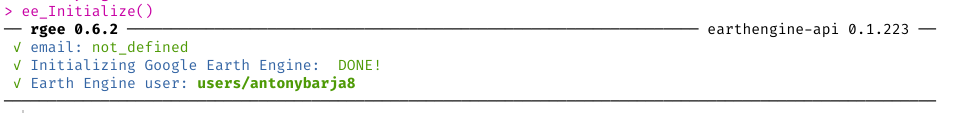
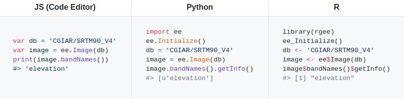
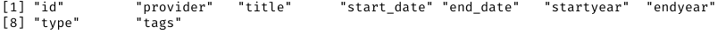
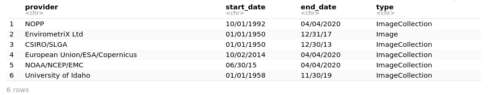
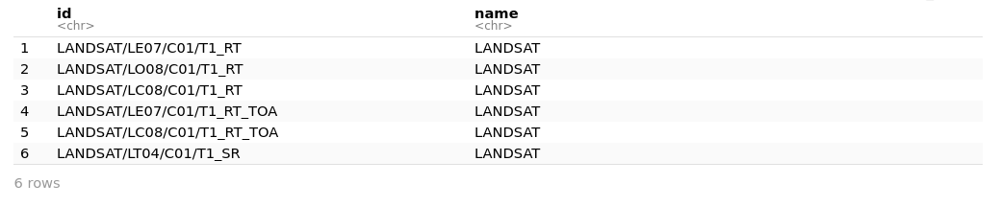
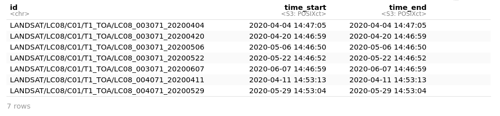
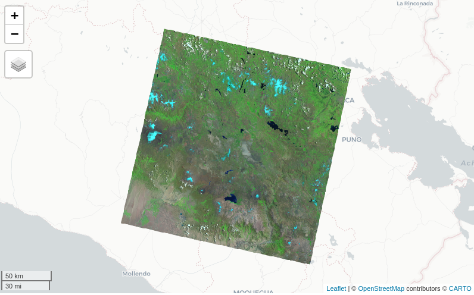

<h3 href= 'https://github.com/r-spatial/rgee' ><small>rgee created by : Cesar Aybar, Qiusheng Wu, Lesly Bautista, Roy Yali, Antony Barja<small/></h3>

\newpage

# Introducción a rgee

`rgee` es una "librería cliente" de Earth Engine para `R`, que permite a los usuarios aprovechar las ventajas que presenta el ecosistema espacial de R dentro de Google Earth Engine y viceversa.   

Todas las clases, módulos y funciones de la API de `Python` de Earth Engine están disponibles en `R` gracias a la librería `reticulate` ; finalmente  `rgee` adiciona nuevos features como el diseño del imput y output de datos, la visualización en mapas interactivos, la facil extracción de series de tiempo, el manejo y la visualización de metadatos.


## Instalación de rgee y otros

Para instalar `rgee` solo necesitamos correr los siguientes comandos: 

```{r,eval=FALSE}
remotes::install_github('r-spatial/rgee')
library(rgee)
ee_install()
ee_Initialize()
```



Para poder potencializar nuestro análisis geoespacial vamos a instalar algunas liberías adicionales, estás son las siguientes:

```{r eval=FALSE}
install.packages('mapview')   # Pkgs visualizar de forma interáctiva
install.packages('tidyverse') # Pkgs para ciencia de datos 
install.packages('sf')        # Pkgs para manejar datos vectoriales
install.packages('starts')    # Pkgs para manejar datos raster
install.packages('cptcity')   # Pkgs para manejar paletas de colores
install.packages('tmap')      # Pkgs para elaborar mapas temáticos
```

Para activar o llamar cada una de las liberías instaladas, empleamos la siguente función `library()` | `requiere()`.

```{r , eval=TRUE,message=FALSE}
library(mapview)
library(tidyverse)
library(sf)
library(stars)
library(cptcity)
library(tmap)
```

## Sintáxis básica de rgee

`rgee` presenta una sintaxis muy similar a la de JavaScript o a la de Python como se muestra en la siguiente figura (Fig.02); sin embargo, hay algunas consideraciones que debes de tomar en cuensta, y este se detalla en el siguiente enlace [aquí.](https://r-spatial.github.io/rgee/articles/considerations.html)



## Visualizando el cátagalo de Google Earth Engine dentro de R

```{r,eval=FALSE}
ee_search_dataset() %>% 
  colnames()
```



```{r ,eval=FALSE}
ee_search_dataset() %>% 
  select('provider','start_date', 'end_date','type') %>% 
  head()

```


Visualizando los **Collection Snippet** de `Landsat` 

```{r, eval=FALSE}
ee_search_dataset() %>% 
  select(id) %>% 
  filter(str_detect(id, 'LANDSAT')) %>% 
  mutate(name = 'LANDSAT') %>% 
  head()
```


Imágenes disponibles por fechas para una ubicación espéfica

```{r,eval=FALSE}
disponible <- ee$ImageCollection('LANDSAT/LC08/C01/T1_TOA')$
  filterDate('2020-04-01','2020-06-30')$
  filterBounds(ee$Geometry$Point(-71.68,-15.65))

ee_get_date_ic(disponible)
```



Visualizando la mejor escena 

```{r,eval=FALSE}
lista <- ee$ImageCollection('LANDSAT/LC08/C01/T1_TOA')$
  filterDate('2020-01-01','2020-07-01')$
  filterBounds(ee$Geometry$Point(-71.68,-15.65))$
  filterMetadata('CLOUD_COVER','less_than',10)

ee_get_date_ic(lista)

```


```{r,eval=FALSE}
viz = list(min = 0,
           max = 0.7,
           bands = c('B7','B5','B4'),
           gamma = 1.75)

landsat <- ee$Image('LANDSAT/LC08/C01/T1_TOA/LC08_003071_20200303')
Map$centerObject(eeObject = landsat,zoom = 8)
Map$addLayer(eeObject = landsat,visParams = viz)
```




####
####
####
####
####
####

# Caso prático: SAR para el mapeo de inundaciones usando rgee 

## Obtención de imágenes Sentinel - 1
## Ámbito de estudio  
## Visualizando datos de sentinel-1
## Filtro de datos de sentinel-1 por fechas
## Combinación RGB
## Aplicando un filtro de "speckle"
## Diferencia entre un antes y después
## Indentificación de áreas inundadas


