###
###
###
<center>
<h3 href= 'https://github.com/r-spatial/rgee' ><small>rgee created by : Cesar Aybar, Qiusheng Wu, Lesly Bautista, Roy Yali, Antony Barja<small/></h3>
<center/>
\newpage

# Introducción a rgee

`rgee` es una "librería cliente" de Earth Engine para `R`, que permite a los usuarios aprovechar las ventajas que presenta el ecosistema espacial de R dentro de Google Earth Engine y viceversa.   

Todas las clases, módulos y funciones de la API de `Python` de Earth Engine están disponibles en `R` gracias a la librería `reticulate` <3 ; finalmente  `rgee` adiciona nuevos features como el diseño del imput y output de datos, la visualización en mapas interactivos, la facil extracción de series de tiempo, el manejo y la visualización de metadatos.


## Instalación de rgee y otros

Para instalar `rgee` solo necesitamos correr los siguientes comandos: 

```{r,eval=FALSE}
remotes::install_github('r-spatial/rgee')
library(rgee)
ee_install()
ee_Initialize()
```


Para poder potencializar nuestro análisis geoespacial vamos a instalar algunas liberías adicionales, estás son las siguientes:

```{r eval=FALSE}
install.packages('mapview')   # Para visualizar de forma interáctiva
install.packages('tidyverse') # Para ciencia de datos 
install.packages('sf')        # Para manejar datos vectoriales
install.packages('raster')    # Para manejar datos raster
install.packages('cptcity')   # Para manejar paletas de colores
install.packages('ggmap')     # Para manejar tipos de basemap
```

Para activar o llamar cada una de las liberías instaladas, empleamos la siguente función `library()` | `requiere()`.

```{r , eval=TRUE,message=FALSE}
library(mapview)
library(tidyverse)
library(sf)
library(raster)
library(cptcity)
library(ggmap)
```

## Sintáxis básica de rgee

`rgee` presenta una sintaxis muy similar a la de JavaScript o a la de Python como se muestra en la siguiente figura (Fig.02); sin embargo, hay algunas consideraciones que debes de tomar en cuenta, y esto se detalla en el siguiente enlace [**aquí.**](https://r-spatial.github.io/rgee/articles/considerations.html)


## Explorando el cátalago de datos de Google Earth Engine

```{r, eval=FALSE}
ee_search_dataset() %>% 
  ee_search_type('ImageCollection') %>% 
  ee_search_provider('European Union/ESA/Copernicus') %>% 
  ee_search_title('Sentinel-2')
  
```

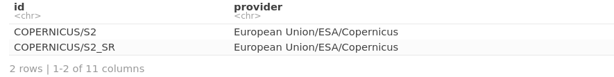


La función `ee_search_display()` nos permite visualizar el catálogo de imágenes satelitales dentro de la misma plataforma de **GEE** como se muestra en la siguiente figura (Fig.03)

```{r,eval=FALSE}

ee_search_dataset() %>% 
  ee_search_type('ImageCollection') %>% 
  ee_search_provider('European Union/ESA/Copernicus') %>%
  ee_search_title('Sentinel-2') %>% 
  ee_search_display()

```

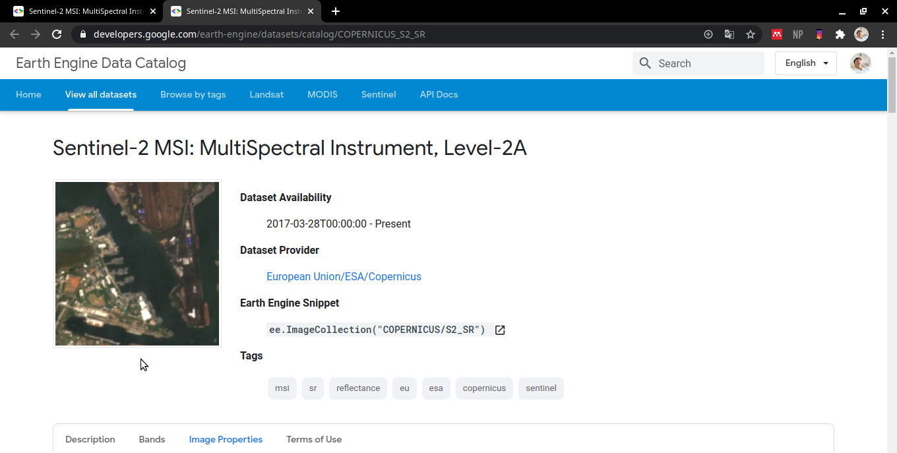

Visualización del cátagalo de Google Earth Engine dentro de R

```{r,eval=FALSE}
ee_search_dataset() %>% 
  colnames()
```


```{r ,eval=FALSE}
ee_search_dataset() %>% 
  select('provider','start_date', 'end_date','type') %>% 
  head()

```


## Explorando y visualizando imágenes `Landsat`,`Sentinel`,`MODIS` y `Aster`

```{r, eval=FALSE}
ee_search_dataset() %>% 
  select(id) %>% 
  filter(str_detect(id, 'LANDSAT')) %>% 
  mutate(name = 'LANDSAT') %>% 
  head()
```


Imágenes de `Landsat8` disponibles por fechas para una ubicación especifica:

```{r,eval=FALSE}
disponible <- ee$ImageCollection('LANDSAT/LC08/C01/T1_TOA')$
  filterDate('2020-04-01','2020-06-30')$
  filterBounds(ee$Geometry$Point(-71.68,-15.65))

ee_get_date_ic(disponible)
```


Visualización de la mejor escena:

```{r,eval=FALSE}
lista <- ee$ImageCollection('LANDSAT/LC08/C01/T1_TOA')$
  filterDate('2020-01-01','2020-07-01')$
  filterBounds(ee$Geometry$Point(-71.68,-15.65))$
  filterMetadata('CLOUD_COVER','less_than',10)

ee_get_date_ic(lista)

```


```{r,eval=FALSE}
viz = list(min = 0,
           max = 0.7,
           bands = c('B7','B5','B4'),
           gamma = 1.75)

landsat <- ee$Image('LANDSAT/LC08/C01/T1_TOA/LC08_003071_20200303')
Map$centerObject(eeObject = landsat,zoom = 8)
Map$addLayer(eeObject = landsat,visParams = viz)
```


Visualización de imágenes `sentinel 1, 2, 5`

**Sentinel-1**

```{r,eval=FALSE}
latlon <- ee$Geometry$Point(-69.96,-12.84)
coleccionVV <- ee$ImageCollection('COPERNICUS/S1_GRD')$
  filterDate('2016-01-01', '2016-05-31')$
  filter(ee$Filter$eq('instrumentMode', 'IW'))$
  filter(ee$Filter$eq('orbitProperties_pass', 'ASCENDING'))$
  filterMetadata('resolution_meters', 'equals' , 10)$
  filterBounds(latlon)$
  select('VV')

Map$centerObject(latlon,zoom = 12)
coleccionVV$
  median()%>% 
  Map$addLayer(visParams = list(min= -20 , max= -5))
```

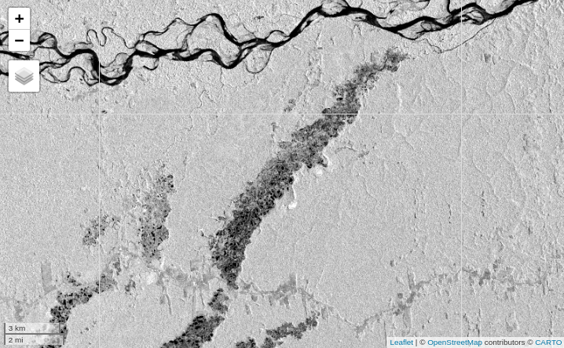

**Sentinel-2**

```{r, eval=FALSE}
coleccion_sen2 <- ee$ImageCollection('COPERNICUS/S2')$
  filterDate('2016-01-01','2016-12-30')$
  filterBounds(latlon)$
  filterMetadata('CLOUDY_PIXEL_PERCENTAGE','less_than',5)

ee_get_date_ic(coleccion_sen2)

```


```{r,eval=FALSE}
id <- 'COPERNICUS/S2/20160917T150612_20160917T150614_T19LCF'
sen2 <- ee$Image(id)
Map$centerObject(latlon,zoom = 12)  

sen2 %>% 
  Map$addLayer(visParams = list(min = 450,
                                max =3500,
                                bands= c('B11','B8A','B2'),
                                gamma = 0.5))


```
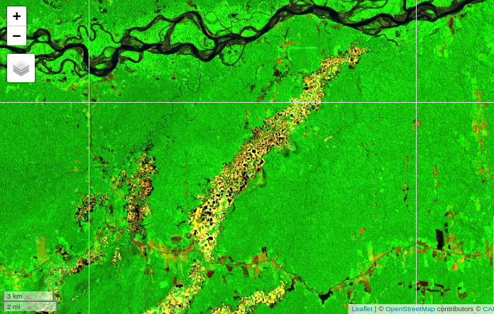


Visualización de imágenes MODIS

```{r,eval=FALSE}
list_modis <- ee$ImageCollection('MODIS/006/MOD13A2')$
  filterDate('2016-01-01','2016-12-31')$
  filterBounds(latlon)$
  select("NDVI")

```

Visualizando una escena promedio de un mes específico

```{r,eval=FALSE}

modis_feb <- ee$Image(list_modis$filterDate('2016-02-01','2016-02-29')$mean())
viz <- list(min = 0.0,
              max = 9000.0,
              bands = "NDVI",
              palette = c(
                'FFFFFF', 'CE7E45', 
                'DF923D', 'F1B555',
                'FCD163', '99B718',
                '74A901', '66A000',
                '529400', '3E8601', 
                '207401', '056201',
                '004C00', '023B01',
                '012E01', '011D01', 
                '011301')
            )

Map$centerObject(latlon, zoom = 9)
modis_feb %>% 
  Map$addLayer(visParams = viz) + 
  Map$addLayer(latlon,visParams = list(color = '0518DC'))

```


Con `rgee` puedes analizar **series de tiempos** de forma rápida y con pocas lineas de código, para está ocación vamos a ver la variación mensual de nuestro punto de control en campo.

*obs: `èe_extract()` nos permite estraer los valores pixeles a la geometría asociada*

```{r, eval=FALSE}
ndvi_ts <- ee_extract(list_modis,
                      latlon,
                      fun = ee$Reducer$mean())

colnames(ndvi_ts) <- sprintf("%02d", 1:12)

ndvi_ts %>%
  reshape2::melt() %>%
  separate(variable,into = c("año","mes","día"),sep = "_") %>%
  group_by(mes) %>% 
  summarise(ndvi_mes =mean(value)) %>%
  mutate(id = 1) %>% 
  ggplot(aes(x = mes,y = ndvi_mes)) +
  geom_line(aes(group = id),color = "#9ACD32",lwd = 2) +
  geom_point(size = 4) +
  theme_bw()

```

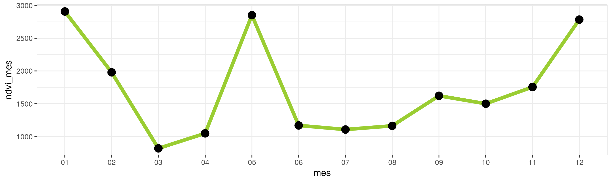

Visualización de imágenes `ASTER`

```{r,eval=FALSE}
list_aster <- ee$ImageCollection('ASTER/AST_L1T_003')$
  filterDate('2016-01-01', '2018-12-15')$
  filterBounds(latlon)$
  filterMetadata('CLOUDCOVER','less_than',1)

ee_get_date_ic(list_aster)
```

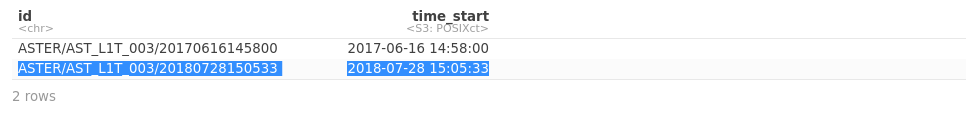


Seleccionamos la segunda escena 

```{r, eval=FALSE}
id <- 'ASTER/AST_L1T_003/20180728150533'
Map$centerObject(latlon,zoom = 12)

ee$Image(id) %>% 
  Map$addLayer(visParams = list(min = 25, 
                                max = 150,
                                bands = c('B3N','B02','B01'),
                                gamma = 1.2))

```

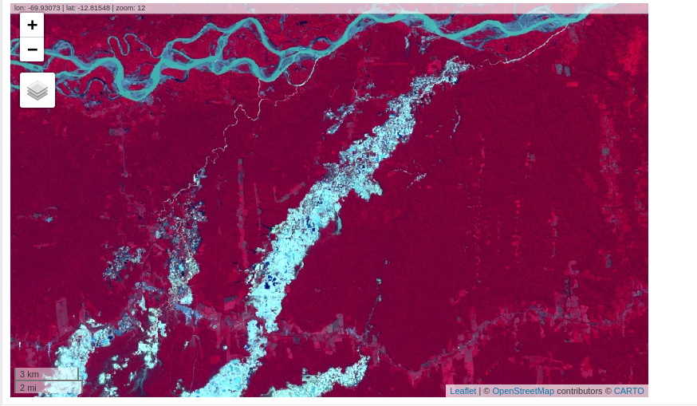

## Cálculo de índices espectrales 

Dentro de **R** puedes crear tus propias funciones y puedes calcular cualquier indices espectral, pero existen algunas funciones
nativas dentro de `rgee` como `normalizedDifference` que te permiten calcular el ndvi y otros indices derivados

**NDVI en Sentinel2**
```{r,eval=FALSE}

Map$centerObject(latlon,zoom = 12)
viz <- list(palette = c(
  "#d73027", "#f46d43", 
  "#fdae61", "#fee08b",
  "#d9ef8b", "#a6d96a",
  "#66bd63", "#1a9850")
  )

sen2$normalizedDifference(c('B8A','B4')) %>% 
  Map$addLayer(visParams = viz)


```

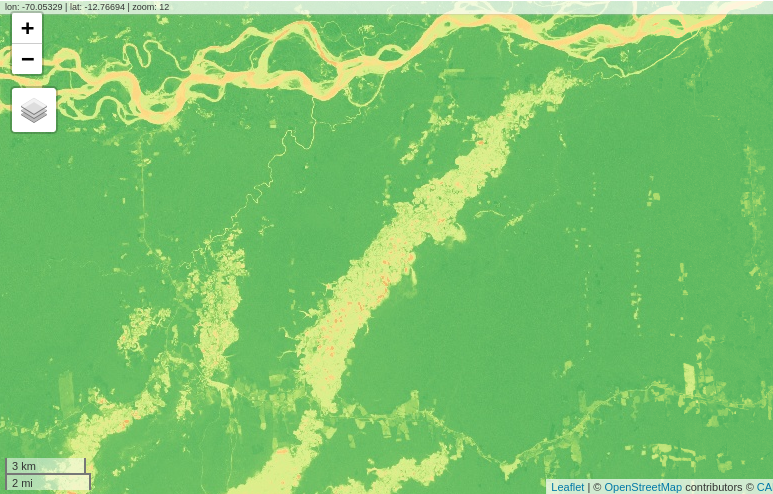


**NDWI en Sentinel2**

```{r,eval=FALSE}
viz <- list(
  min = -0.15,
  max = 0.65,
  palette = c(
    '#ffff', '#ffff', '#ffff',
    '#ffff', '#ffff', '#0000ff',
    '#0000ff')
  )

sen2$normalizedDifference(c('B8','B11')) %>% 
  Map$addLayer(visParams = viz)
```

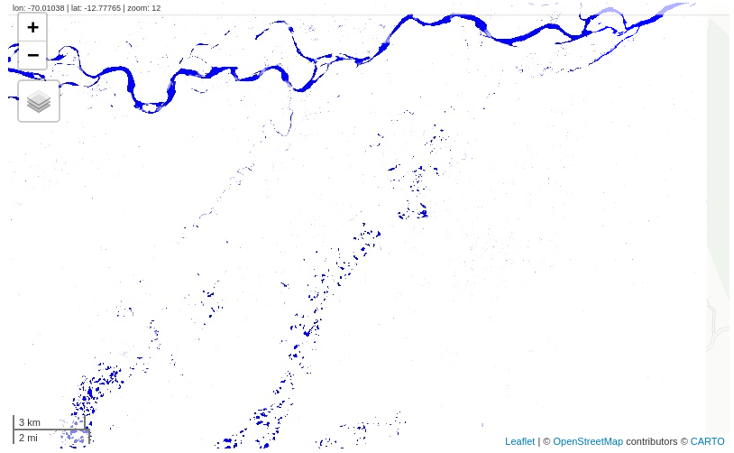


# Caso prático: Mapeo de deslizamientos con rgee

## Ámbito de estudio  

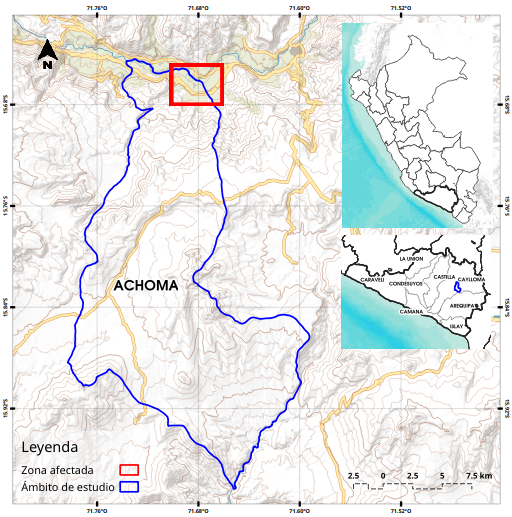

## Obtención de imágenes Sentinel - 2

```{r, eval=FALSE}
box <- ee$Geometry$Rectangle(coords = c(-71.72,-15.67,-71.67,-15.64),
                             proj = "EPSG:4326",
                             geodesic = FALSE)
coleccion_sen2 <- ee$ImageCollection('COPERNICUS/S2_SR')$
  filterDate('2020-06-23','2020-06-28')$
  filterBounds(box)$
  filterMetadata('CLOUDY_PIXEL_PERCENTAGE','less_than',40)

ee_get_date_ic(coleccion_sen2)
```

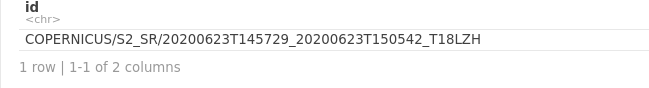


```{r, eval=FALSE}

id_img <- 'COPERNICUS/S2_SR/20200623T145729_20200623T150542_T18LZH'
sen2 <- ee$Image(id_img)$
  clip(box)
Map$centerObject(box)

viz <-list(min = 450,
           max =3500,
           bands= c('B8A','B4','B3'),
           gamma = 1.2)

Map$addLayer(sen2,visParams = viz)
```

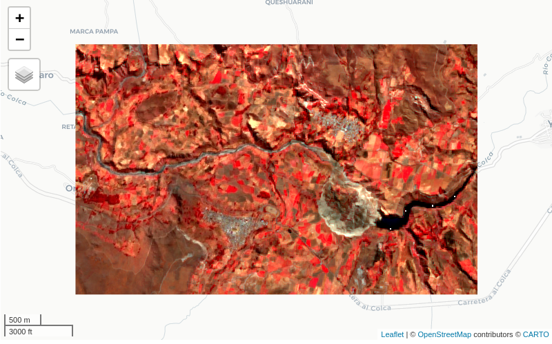


## Clasificación No Supervisada

```{r,eval=FALSE}
# Conjunto de datos de entrenamiento
training <- sen2$sample(
  region = box,
  scale = 10,
  numPixels = 10000
)

# Generar el número cluster y entrenear
clusterer <- ee$Clusterer$wekaKMeans(10)$train(training)

# Clasificar la imágenes usando el cluster entrenado
result <- sen2$cluster(clusterer)

# Visualización de la imágen clasificada
Map$centerObject(box)
Map$addLayer(
  eeObject = result$randomVisualizer(),
  name = "clusters"
)


```

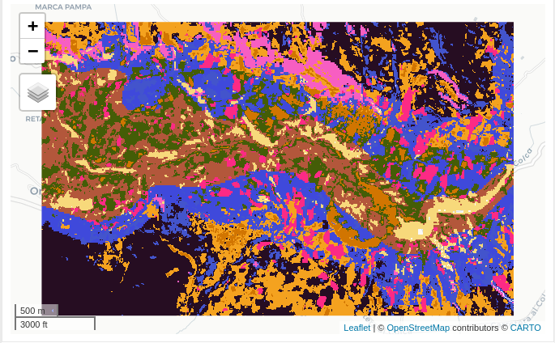

## Transformar un objeto ee.Image a un objeto Raster* 

Rgee tiene funciones para transformar un objeto de earhtengine a un objeto de tipo raster* dentro de R, para esto vamos usar la función `ee_as_raster()` como se muestra en la siguiente linea de código: 

```{r,eval=FALSE}
result %>% 
  ee_as_raster(region = box,
               scale = 10,) -> img_clas

```

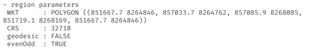

## Seleccionar el mejor cluster que carácteriza la amenaza (cluster 6 y 5)

```{r,eval=FALSE}
img_clas %>% 
  projectRaster(crs = '+proj=longlat +ellps=WGS84 +datum=WGS84 +no_defs ') %>% 
  as('SpatialPixelsDataFrame') %>% 
  subset(cluster <= 6 & cluster > 5 ) %>% 
  raster() %>% 
  as.data.frame(xy = TRUE) %>%
  na.omit() %>% 
  mutate(id = 1) -> clase_des

# Visualización simple usando ggplot
clase_des %>% 
  ggplot() + 
  geom_tile(aes(x = x, y = y, fill = factor(id,labels = 'cluster:: 06-05')))+ 
    scale_fill_manual(values = "red",name= "Leyenda")

```

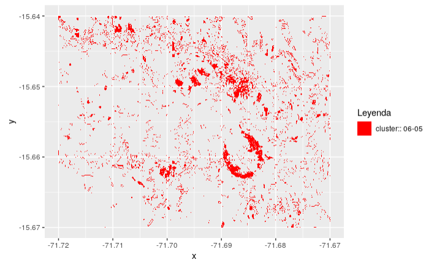

## Elaboración de mapa final 

```{r,eval=FALSE}
us <- c(left = -71.72,
        bottom = -15.67,
        right = -71.67,
        top = -15.64)

get_map(us,
        zoom = 14,
        maptype = "satellite") %>%
  ggmap() +
  geom_tile(data = clase_des,
            aes(x = x,
                y = y,
                fill = factor(id,
                              labels = "cluster_06_05"))) +
  scale_fill_manual(values = "red",
                    name= "Map") + 
  ggtitle("Kmeans-clustering - Sentinel2") +
  theme(plot.title = element_text(lineheight =.4,
                                  face="bold"),
        legend.position = c(0.10,0.05))

```

