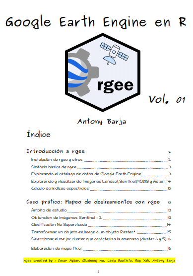

# Handbook de Google Earth Engine en R vol.01

  

# References : 

* r-spatial/rgee, (2020), C Aybar, Q Wu, L Bautista, R Yali and A Barja (2020), *https://github.com/r-spatial/rgee*

 All data produced in this project are published under a [Creative Commons license (CC BY 3.0 IT)]((https://creativecommons.org/share-your-work/)): Data may be freely reproduced, distributed, transmitted and adapted, including for commercial purposes, provided that the source is acknowledged.
